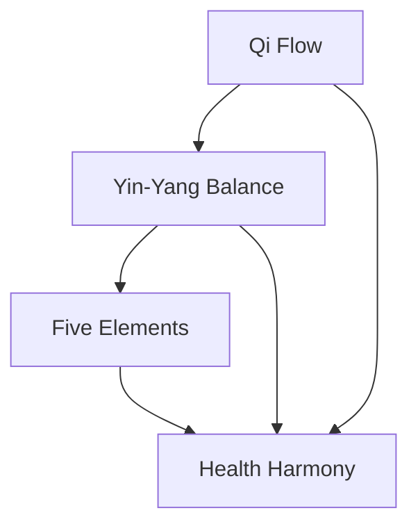

## Discover Traditional Chinese Medicine

YTMEC welcomes you to the ancient yet timeless world of Traditional Chinese Medicine (TCM). Explore its foundational principles like yin-yang balance and the five elements, which have guided health practices for over 2,000 years. This platform connects you with TCM's rich history, cultural depth, and practical applications in modern wellness.

TCM emphasizes harmony between body, mind, and environment. You gain access to curated resources that blend tradition with contemporary science, helping you understand acupuncture, herbal remedies, and qi gong.

<Callout kind="info">
  YTMEC uses brand color `#040404` for a grounded, earthy aesthetic inspired by TCM roots.
</Callout>

## Key Features of YTMEC

YTMEC equips you with comprehensive tools to deepen your TCM knowledge.

<Columns cols={3}>
  <Card title="In-Depth Articles" icon="book-open" href="/docs/articles">
    Read expert insights on TCM history and philosophy.
  </Card>
  <Card title="Interactive Courses" icon="play-circle" href="/docs/courses">
    Enroll in guided lessons on meridians and diagnostics.
  </Card>
  <Card title="Herbal Database" icon="leaf" href="/docs/herbs">
    Search 500+ herbs with properties and uses.
  </Card>
</Columns>

## TCM Principles and Applications

Dive into core TCM concepts through structured paths.

<Tabs>
  <Tab title="Core Principles" icon="balance-scale">
    TCM revolves around qi (vital energy), yin-yang duality, and the five elements (wood, fire, earth, metal, water). You balance these for optimal health.
  </Tab>
  <Tab title="Historical Significance" icon="history">
    Originating in ancient China, TCM texts like the Huangdi Neijing shape global wellness today. Cultural rituals preserve its legacy.
  </Tab>
  <Tab title="Modern Applications" icon="activity">
    Integrate TCM with Western medicine for holistic care, from stress relief to chronic condition management.
  </Tab>
</Tabs>

## Get Started in Minutes

Follow these steps to begin your TCM journey on YTMEC.

<Steps>
  <Step title="Create Account" icon="user-plus">
    Sign up with your email to unlock personalized recommendations.
  </Step>
  <Step title="Explore Resources" icon="search">
    Browse categories like acupuncture and nutrition.
  </Step>
  <Step title="Join Community" icon="users">
    Participate in forums to discuss TCM practices.
  </Step>
</Steps>

## Platform Goals and Your Benefits

YTMEC aims to democratize TCM knowledge. You benefit from evidence-based content, updated regularly, fostering informed self-care. Our mission promotes cultural preservation while adapting TCM for today's lifestyles.

<Expandable title="Cultural Significance of TCM" default-open="false">

TCM embodies Chinese philosophy, influencing art, cuisine, and festivals. You connect with global practitioners sharing time-tested wisdom.

</Expandable>

## Why Choose YTMEC?

With intuitive navigation and mobile-friendly design, YTMEC stands out. Track your learning progress and receive tailored herb suggestions. Join thousands exploring TCM's profound impact on well-being. Start today and harmonize your health.