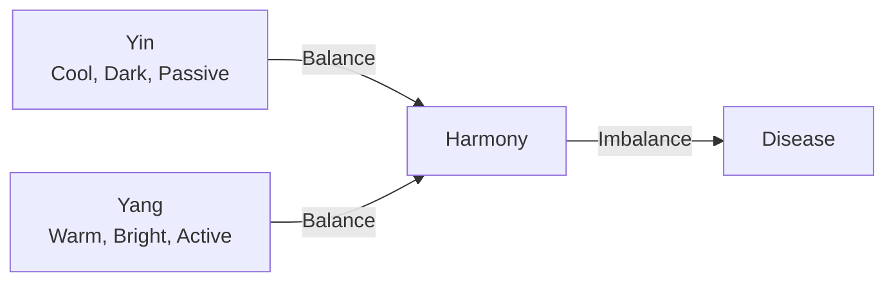
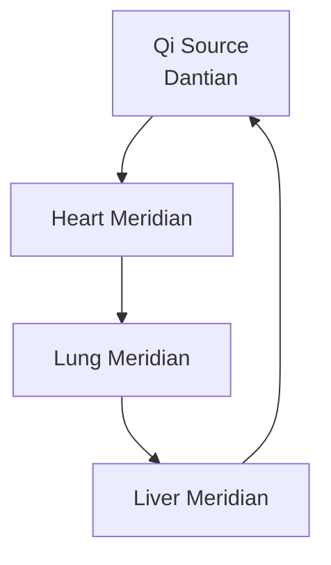

## Overview

Traditional Chinese Medicine (TCM) rests on ancient philosophies that explain health, disease, and the universe. You encounter these core concepts—Yin and Yang, Five Elements, Qi, meridians, and energy flow—throughout TCM practices. They form the foundation for diagnosis, treatment, and prevention. Grasping them empowers you to appreciate TCM's holistic approach.

<Callout kind="info">
  TCM views the body as an interconnected system in harmony with nature. Imbalances in these concepts signal illness.
</Callout>

<Columns cols={2}>
  <Card title="Yin and Yang" icon="balance" href="#yin-yang">
    Opposing forces in dynamic balance.
  </Card>
  <Card title="Five Elements" icon="grid" href="#five-elements">
    Wood, Fire, Earth, Metal, Water cycles.
  </Card>
  <Card title="Qi and Meridians" icon="zap" href="#qi-meridians">
    Vital energy pathways.
  </Card>
  <Card title="Evolution" icon="history" href="#evolution">
    From ancient texts to today.
  </Card>
</Columns>

## Yin and Yang Theory

Yin and Yang represent complementary opposites: Yin as cool, passive, and feminine; Yang as warm, active, and masculine. You maintain health by balancing them. Excess Yin causes cold conditions; excess Yang leads to heat.

<Expandable title="Deeper Dive: Daily Applications">
  Observe Yin-Yang in your routine: rest (Yin) after activity (Yang). Acupuncture restores balance by targeting points.
</Expandable>

## Five Elements Framework

The Five Elements—Wood, Fire, Earth, Metal, Water—interact through generating and controlling cycles. You use this to diagnose organ relationships.

| Element | Organs          | Emotion | Season |
|---------|-----------------|---------|--------|
| Wood    | Liver, Gallbladder | Anger  | Spring |
| Fire    | Heart, Small Intestine | Joy   | Summer |
| Earth   | Spleen, Stomach | Worry  | Late Summer |
| Metal   | Lungs, Large Intestine | Grief | Autumn |
| Water   | Kidneys, Bladder | Fear  | Winter |

<Callout kind="tip">
  Trace symptoms: Liver (Wood) issues may weaken Lungs (Metal) via controlling cycle.
</Callout>

## Qi, Meridians, and Energy Flow

Qi is your vital life force flowing through 12 main meridians—pathways connecting organs. Blockages disrupt health; you clear them via acupuncture or herbs.

<Steps>
  <Step title="Assess Flow" icon="search">
    Check pulse and tongue for Qi stagnation.
  </Step>
  <Step title="Stimulate Points" icon="zap">
    Apply needles to meridian points like LI4 for headaches.
  </Step>
  <Step title="Maintain Balance" icon="shield">
    Practice Qigong daily to circulate Qi.
  </Step>
</Steps>

## Historical Evolution and Modern Relevance

<Tabs>
  <Tab title="Ancient Roots" icon="history">
    Originating 2,000+ years ago in `Huangdi Neijing`, TCM evolved through dynasties. Philosophers integrated Yin-Yang with cosmology.
  </Tab>
  <Tab title="Modern Integration" icon="trending-up">
    Today, you find TCM in WHO-recognized practices. Evidence supports acupuncture for pain; herbs complement Western medicine.
  </Tab>
</Tabs>

<ExpandableGroup>
  <Expandable title="Key Milestones" default-open="true">
    - 221 BCE: Qin unification standardizes texts.
    - 1950s: China modernizes TCM with science.
  </Expandable>
  <Expandable title="Bridging Worlds">
    Research validates Qi effects via biofields. Use TCM alongside biomedicine for holistic care.
  </Expandable>
</ExpandableGroup>