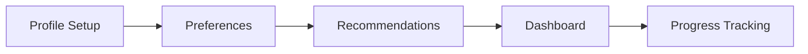

## Overview

YTMEC provides a rich library of Traditional Chinese Medicine (TCM) resources, including articles, interactive tools, and personalized learning paths. You can browse historical insights on `Qi` circulation, explore herb databases, or engage with quizzes on `Yin-Yang` principles. This guide walks you through key features to maximize your learning.

<Columns cols={3}>
  <Card title="Browse Articles" icon="book-open" href="#browsing">
    Discover TCM principles and case studies.
  </Card>
  <Card title="Interactive Tools" icon="play-circle" href="#interactive">
    Practice with quizzes and simulations.
  </Card>
  <Card title="Search & Filter" icon="search" href="#searching">
    Find specific content quickly.
  </Card>
</Columns>

## Browsing Articles and Insights

Start your TCM journey by exploring curated articles. The platform organizes content into categories like Acupuncture, Herbal Medicine, and Diagnostic Methods.

<Steps>
  <Step title="Navigate Categories" icon="menu">
    Click the main menu and select a topic, such as `TCM Fundamentals`.
  </Step>
  <Step title="Read Insights" icon="book-open">
    Scan article previews, then dive into full texts with embedded diagrams.
  </Step>
  <Step title="Bookmark Favorites" icon="bookmark">
    Save articles for later review in your dashboard.
  </Step>
</Steps>

<Callout kind="tip">
  Articles include audio narration for `Qi Gong` practices—enable it via the speaker icon.
</Callout>

## Searching and Filtering Content

Efficiently locate resources using the global search bar. Support advanced queries for precise results.

<Tabs>
  <Tab title="Basic Search" icon="search">
    Enter keywords like `Acupuncture meridians`.
  </Tab>
  <Tab title="Advanced Filters" icon="filter">
    Combine with filters for era (e.g., `Classical TCM`) or type (e.g., `Videos`).
  </Tab>
</Tabs>

Use these query examples:

<CodeGroup tabs="Simple,Advanced">
  ```text
  Acupuncture points
  ```
  ```text
  "Yin deficiency" AND herbs >1800
  ```
</CodeGroup>

| Filter Type | Options | Example Use |
|-------------|---------|-------------|
| Category    | Acupuncture, Herbs, Diagnosis | Narrow to `Herbs` only |
| Era         | Classical, Modern | Focus on `Classical` texts |
| Media Type  | Article, Video, Quiz | Select `Video` for visuals |
| Difficulty  | Beginner, Intermediate, Advanced | Match your level |

## Engaging with Interactive Learning Tools

YTMEC offers hands-on tools to reinforce TCM concepts.

<ExpandableGroup>
  <Expandable title="Quizzes" default-open="true">
    Test knowledge on `Five Elements` theory. Scores sync to your profile.
  </Expandable>
  <Expandable title="Simulations">
    Practice pulse diagnosis virtually—drag to identify `Wiry` or `Slippery` pulses.
  </Expandable>
</ExpandableGroup>

<Steps>
  <Step title="Launch Tool" icon="play-circle">
    From the tools menu, select `Pulse Simulator`.
  </Step>
  <Step title="Interact" icon="mouse-pointer">
    Follow on-screen prompts and receive instant feedback.
  </Step>
  <Step title="Review Results" icon="check-circle">
    Access detailed explanations for incorrect answers.
  </Step>
</Steps>

## Personalizing Your Learning Experience

Tailor YTMEC to your needs for a customized journey.

1. Create a profile with your TCM interests (e.g., `Pediatric TCM`).
2. Set preferences for content recommendations.
3. Track progress via the dashboard—view completion rates for quizzes.

<Callout kind="info">
  Enable notifications for new articles on topics like `Moxibustion` techniques.
</Callout>



Follow these steps to optimize your experience and deepen your TCM knowledge effectively.